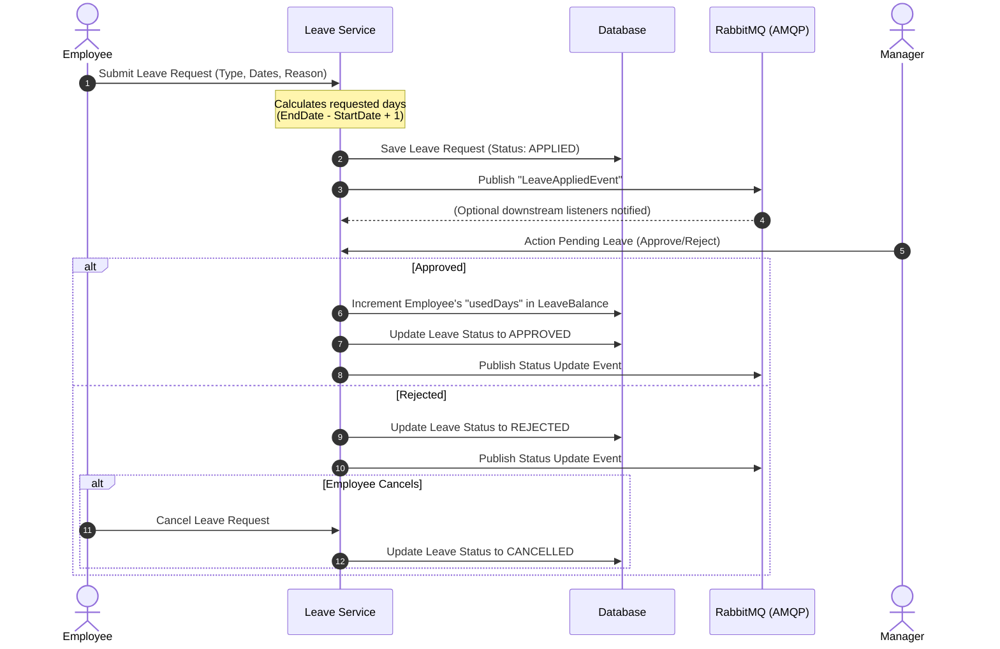

# RevTalent Leave Management Service

The **Leave Service** manages employee time-off requests, approval/rejection pipelines, calendar calculations, and real-time leave balance adjustments inside the **RevTalent** HRMS ecosystem.

---

##  Business & Event Workflow

The leave tracking lifecycle is driven by synchronous updates combined with asynchronous message publishing:

### 1. Leave Submission (Application)
- The employee applies for a leave (e.g. SICK, CASUAL, ANNUAL) specifying the start and end dates.
- The service validates the inputs and determines the total duration requested.
- The request is saved in the database with status `APPLIED`.
- An asynchronous `LeaveAppliedEvent` containing request metadata (leave ID, employee name, dates, reason, and manager ID) is published to **RabbitMQ** to trigger external notifications or email dispatches.

### 2. Review & Decisions (Approve/Reject)
- Managers query their reportees' pending leave applications.
- **Approve Action**:
  - The request status is set to `APPROVED`.
  - The system loads the employee's active `LeaveBalance` record matching the request's leave type and calendar year.
  - The employee's `usedDays` attribute is incremented by the approved amount.
  - A status update event is published to RabbitMQ.
- **Reject Action**:
  - The status is set to `REJECTED` (with an optional rejection reason).
  - A status update event is published to RabbitMQ.

### 3. Leave Cancellation
- Employees can cancel their leave request before/during the process, updating its status to `CANCELLED`.

---

##  Dependencies Added

The service uses the following libraries in its `pom.xml`:

- **Spring Boot AMQP / RabbitMQ** (`spring-boot-starter-amqp`): Handles publishing and receiving asynchronous messages.
- **Spring Boot Data JPA** (`spring-boot-starter-data-jpa`): Handles Hibernate object-relational mapping to MySQL.
- **Spring Boot Web** (`spring-boot-starter-web`): Core REST API capabilities.
- **Spring Boot Security & JJWT**: Secures APIs and parses credentials from authorization header tokens.
- **MySQL Driver** (`mysql-connector-j`): SQL database driver connector.
- **Netflix Eureka Client** (`spring-cloud-starter-netflix-eureka-client`): Registers this service with Eureka for discovery.
- **Spring Cloud Config Client** (`spring-cloud-starter-config`): Loads external database and rabbitmq broker settings.
- **Lombok** (`lombok`): Auto-generates getters, setters, and builders.
- **Jacoco Quality Gate** (`jacoco-maven-plugin`): Configured to monitor unit testing coverage.
